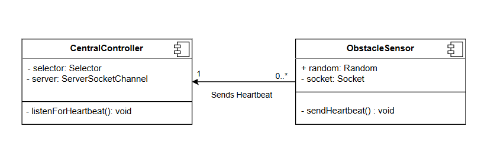
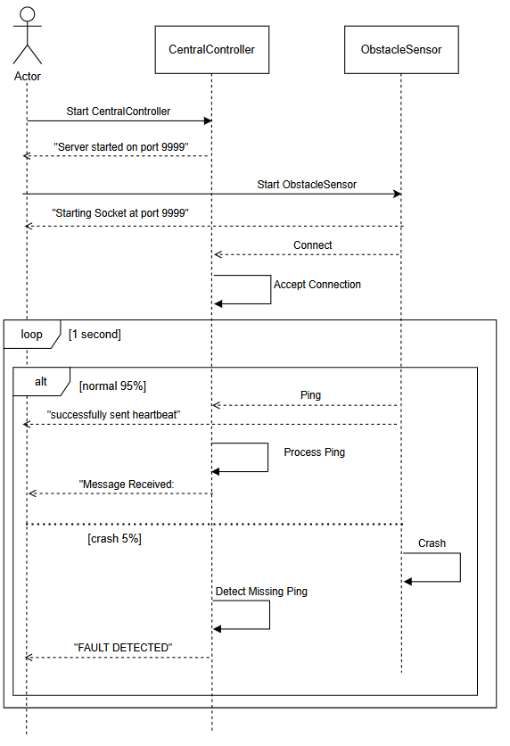

# Heartbeat Tactic Implementation

- Chris Shepard
- Lucille Blain
- Dan Corcoran

## How To Run The Code

1. Open a terminal and navigate to the src directory of the project
2. In the terminal, type `javac *.java`. This will compile the java code and allow it to be run from multiple terminals
3. In the same terminal, type `java CentralController`. You should see a message saying "Server started on port 9999". Keep this terminal open.
4. Open another terminal and navigate to the root directory and type `java SensorNode 'SensorName'`. Replace 'SensorName' with any name for the sensor, don't include the ' '. You should begin to see the Sensor sending out a Heartbeat
5. Look at the CentralController terminal and you should see a message appear from that sensor. There is a 5% chance every heartbeat that the ObstacleSensor will fault, once it does, the sensor will crash, and the controller should see that the connection was lost
6. Repeat step 4 with as many sensors as you would like, give them different names for output purposes. Make sure to run each sensor in its own terminal
7. Close all terminals once done

## Code Breakdown

The logic found inside of the CentralController is adapted from the following website 'https://www.baeldung.com/java-nio-selector'. It details how to use the NIO library to accept multiple connections. Their implmentation covers many of the basics and only had to be slightly adapted to fit the projects needs.

For the CentralController we do the following. Selector is used to monitor multiple different connections on the same server. We tell the server that it can accept new connections, and then once a connection is established, we tell the server that it can read from those connections. This is how multiple different sensors can communicate with the one controller. Everytime we have an event, we determine if we are connecting to a new socket or reading from an existing one. When reading from the existing socket, if we get a -1 buffer read size, it means the message failed to send and a fault has occured.

For the ObstacleSensor the logic is very standard. We create a new socket running locally located at the same port as the CentralController. Every second we send a message saying "Im Alive". 5% of the time we simulate a fault and crash the sensor. The user will provide a name for the sensor upon initialization. Multiple sensors can be running at the same time, each on a different terminal.

## External Libraries

- ObstacleSensor.java

1. java.net -> Used for creating and sending information through a socket in byte form
2. java.util.Random -> Used for generating a random percent change of a system crash

- CentralController.java

1. java.io.IOException -> Used to raise an exception if something goes wrong with the Selector
2. java.net.InetSocketAddress -> Creates a socket with a specified port
3. java.util.Iterator -> Used to loop over the java.nio connected channels
4. java.nio.* -> This is the major library used for the CentralController, this allows for connecting to multiple different sockets through non-blocking operations. It will read and process information on multiple sockets at the same time. This library allows the user to specify what type of data they would like to process (accepting connections, reading data, etc.). It is responsible for registering the connections with the central server.

## UML Diagram

Above is the UML diagram for this implementation of the Heartbeat tactic. Both the CentralController and ObstacleSensor are of the component type. This distinction of a component over a standard class is made to represent that the CentralController and ObstacleSensor run on different processors. The CentralController has a selector which listens and processes the connections, it also has a server which the selector runs on. The ObstacleSensor has a standard socket which it runs on. The arrow direction indicates that the ObstacleSensor sends heartbeats to the central controller, not the other way around which would be more indicative of a ping/echo pattern. In terms of the multiplicities, we have 1 CentralController and N number of ObstacleSensors, this shows that any number of sensors can talk to the 1 CentralController. 

## Sequence Diagram

Above is the sequence diagram for this implementation of the Heartbeat tactic. First, we see that the user needs to create the CentralController and the ObstacleSensor, both of which send a message back to the user when this process was successful. When the ObstacleSensor is created it attempts to connect to the CentralController which processes the ACCEPT request. The CentralController doesn't send anything back to the ObstacleSensor to signify that this connection has been established. 

Next, we see a loop tag where we see that the loop occurs every 1 second. Inside of that we see an alt tag signifying that some of the logic can branch into multiple code paths. For our standard execution, which occurs 95% of the time, the ObstacleSensor sends a ping to the CentralController by sending it a message, this message is also sent to the user. When received by the CentralController, the message is processed successfully and sends a message to the user letting them know that they have received a heartbeat. 5% of the time the system crashes. This is seen by the failed message attempt by the ObstacleSensor where the lifeline immediately ends indicating that the ObstacleSensor has gone down. The CentralController recognizes that it has lost connection with the ObstacleSensor and sends an appropriate message back to the user.